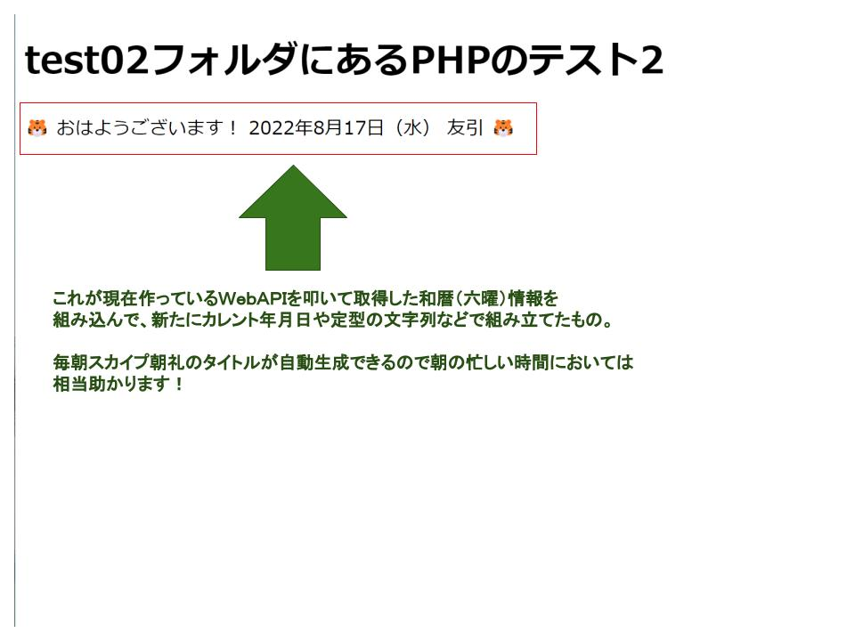

# chatty-journal-20220817

<h2 style="display:inline">本日の活動</h2>

 <h3>早朝学習</h3>
 <ol>
  <li>暦APIを使っての和暦情報取得プログラムついに成功！
      約３日間ほど悩み続けてようやく「APIを提供しているサーバー側の設定をしないと絶対にできないことが分かった」ことです。
      見方によってはなんとも空しい姿に見えるでしょうが、本人は決して肩をがっくり落としているわけではありません。なぜなら、できないことが理解できたことにこそ価値ああるからです。
      なのできっぱり断念しても後悔はなかったですが、これ以上深追いしないで別の発想ができないか挑戦してみました。その結果見つけたのが<a href="">このサイト</a>です。API提供者様自身が公開していらっしゃるサンプルコードをみつけたのです！
      詳しい解説はここでは行いませんが別のリポジトリにてアップするつもりです。結論はばっちり上手くいきました。これをお手本に現在新しいシステムとしてリメイクしているところです。
     

  </li>
  <li></li>
 </ol>
 <ul>
  <li>記号付きリスト</li>
  <li></li>
 </ul>

<h2 style="display:inline">アコーディオンひな形</h2>

 <h3>タイトル</h3>
 <ol>
  <li>番号付きリスト</li>
  <li></li>
 </ol>
 <ul>
  <li>記号付きリスト</li>
  <li></li>
 </ul>

